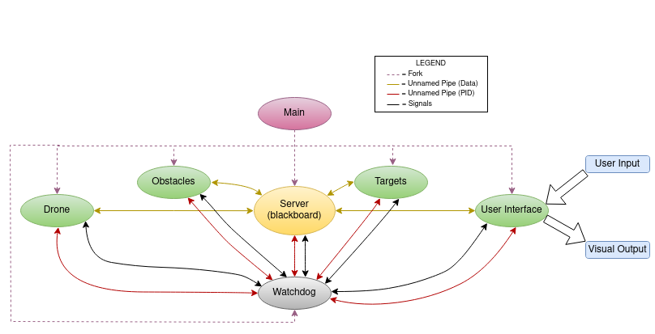

Advanced_Robot_Programming-Assignment_2
================================

Introduction
----------------------
The following repository contains the solution to the second assignment for the Advanced Robot Programming course, found in the Robotics Masters Programme at the University of Genoa, Italy. As part of this assignment,
students were required to program a drone simulator in which a drone, represented by a blue '+', was to be depicted in a window and was capable of being actuated around this space via user inputs. The objective of the 
simulator was for the drone to collect a series of targets that were randomly distributed throughout the available space, while avoiding a series of obstacles that would randomly regenerate after a period of time.
The following work has been performed by Mark Henry Dsouza.

Table of Contents
----------------------
1. [Architecture](https://github.com/Markie3110/Advanced_Robot_Programming-Assignment_2#architecture)
2. [Overview](https://github.com/Markie3110/Advanced_Robot_Programming-Assignment_2#overview)
3. [Installation](https://github.com/Markie3110/Advanced_Robot_Programming-Assignment_2#installation)
4. [How to Run](https://github.com/Markie3110/Advanced_Robot_Programming-Assignment_2#how-to-run)
5. [Operational instructions](https://github.com/Markie3110/Advanced_Robot_Programming-Assignment_2#operational-instructions)
6. [Known Errors](https://github.com/Markie3110/Advanced_Robot_Programming-Assignment_2#known-errors)
7. [Authors Notes](https://github.com/Markie3110/Advanced_Robot_Programming-Assignment_2#authors-notes)


Architecture
----------------------
Shown here is the software architecture of the system depicting the parent/child relationships as well as interprocess communications used.<br>


Overview
----------------------
As depicted in the architecture, the system consists of 7 core processes, namely: main, server, user interface, drone, targets, obstacles and watchdog, that all work concurrently to run the simulator. Besides the core programs, we also have two header files stored in the include folder: parameters and log that are used by the core files during runtime. A detailed description of each is given below.

### Main ###
Main is the parent process of the entire system and is solely responsible for executing each and every individual process required by the simulator. It does this by repeatedly forking itself using the `fork()` function, and then executing each process within the newly created child with `execvp()`. Once all the necessary processes have been created, main waits until all the created children have ended their execution, following which it itself is terminated.

### Server ###
The server is the first of the core processes to be run by the parent. Its role is to create and allocate shared memory spaces that will subsequently be used by the different processes to transfer data, along with any necessary semaphores needed for the same. Given below are the different variables transfered using the shared memory objects, along with their respective producers and consumers:
| Variable | Producer Process | Consumer Processes |
| --- | --- | --- |
| Watchdog PID | watchdog | server, UI, drone |
| Window Size | UI | drone |
| Drone Position | drone | UI |

Once the shared memory objects have been created, the server runs in a loop with a time interval until it receives a terminate signal (`SIGTERM`) either from the watchdog, or due to a user input.

### User interface ###
The user interface is the frontend process for the entire system. It is the location where all the inputs from the user are gathered, as well as where all the visual outputs to the user are depicted. The process first creates a graphical user interface with the help of the `ncurses` library, consisting of two windows: one drone window, to depict the virtual environement the drone moves in, and an inspector window, that displays the drone's position numerically. Subsequently, the process enters a loop where in each iteration, it looks to see if the user has given any key inputs using the `wgetch()` function, following which it passes on the acquired keyvalue to the shared memory. Given that there may be times the user does not provide any input, to ensure that the `wgetch()` function does not block each iteration of the loop indefinetely waiting for it, we also use the `wtimeout()` function, which specifies a maximum time interval `wgetch()` should wait for, at the end of which the execution is continued. Besides passing keyvalues, the UI also reads the latest drone position from the shared memory and depicts it as such. 

### Drone ###
The drone is the process in which the dynamical behaviour of the drone has been modelled. The equation describing the drone movement have been taken as follows:
```math
F_x = M*{{x_{i-2} + x_i - (2 * x_{i-1})} \over T^2} + K*{{x_i - x_{i-1}} \over T}
```
```math
F_y = M*{{y_{i-2} + y_i - (2 * y_{i-1})} \over T^2} + K*{{y_i - y_{i-1}} \over T}
```
where, $F_x$ and $F_y$ are the input forces in the x and y direction respectively, $T$ is the time interval, $M$ is the mass of the drone, $K$ the coefficient of viscosity, ($x_{i},y_{i}$) the current drone position, ($x_{i-1},y_{i-1}$) the drone position one time interval ago and ($x_{i-2},y_{i-2}$) two time intervals ago. As we want the drone position, we can rewrite the equations as follows:
```math
x_i = {{F*T^2 - M*x_{i-2} + 2*M*x_{i-1} + K*T*x_{i-1}} \over {M + K*T}}
```
```math
y_i = {{F*T^2 - M*y_{i-2} + 2*M*y_{i-1} + K*T*y_{i-1}} \over {M + K*T}}
```
Like the UI, the drone process runs in a loop and receives the keypressed values given by the user. Depending on the value of the key, the input force in either axis is either incremented or decremented. Subsequently, the drone position is calculated using the current values of the input forces and is passed on to the shared memory. Do note, that if the drone is moving and the user pushes the stop key, the drone does not stop immediately, but keeps on moving for a small duration due to inertia.

### Watchdog ###
The watchdog is the process that oversees the overall system behaviour by observing all the processes and terminating everything if any of them encounter a critical error. During their intialization, every process sends their pids to the watchdog using named pipes, which in turn conveys its own pid to them using a shared memory object. Using these pids, the watchdog sends a `SIGUSR1` signal to a process, which in turn is supposed to send back a `SIGUSR2` signal if it is working properly. The watchdog waits for upto three cycles, characterised by a time duration, for a response. If the process does not return the required signal within the required number of cycles, the watchdog takes this to mean that the process has encountered a critical error and subsequently terminates all the running processes. On the other hand, if the signal is received within the specificied time, the watchdog moves on to the next process. Once the watchdog reaches the final pid, it returns back to the first and starts over until the user terminates the system.

### Parameters ###
The parameter file contains a set of constants that are used by the processes, stored in one compact location.

### Log ###
The log parameter file defines a series of functions that allow the processes to open and edit log files during runtime.


Installation
----------------------
The core content of the project can be found in the folder "Assignment_1". To download the repository's contents to your local system you can do one of the following:

1. Using git from your local system<br>
To download the repo using git simply go to your terminal and go to the root directory of your system. Type the following command to clone the repository:
```bash
$ git clone "https://github.com/Markie3110/Advanced_Robot_Programming-Assignment_1"
```

2. Download the .zip from Github<br>
In a browser go to the repository on Github and download the .zip file available in the code dropdown box found at the top right. Unzip the file to access the contents and store the Assignment_1 folder in your root directory.<br><br>
**NOTE:** Due to the use of named FIFOs with paths, it is important that the Assignment_1 folder is stored in the root directory of your system. There should be no intermediary folders between the root and Assignment_1
folder or else the system will not run. The directory the processes are executed in is displayed in the konsole terminal for every process. Ensure that the folder is stored only in the path mentioned in the terminal.


How to Run
----------------------
To both build the executables and run the system, navigate to the src folder within a terminal and type in the following command:
```bash
make
```
The simulator should compile and then execute.

Operational instructions
----------------------
To operate the drone use the following keys:
```
'q' 'w' 'e'
'a' 's' 'd'
'z' 'x' 'c'
```
The keys represent the following movements for the drone
* `q`: TOP-LEFT
* `w`: TOP
* `e`: TOP-RIGHT
* `a`: LEFT
* `s`: STOP
* `d`: RIGHT
* `z`: BOTTOM-LEFT
* `x`: BOTTOM
* `c`: BOTTOM-RIGHT
<br><br>In addition, `k` and `l` can be used to reset the drone to its starting point and shut down the entire system respectively.

Known Errors
----------------------
Occassionaly, the simulator may hang or crash after executing `make` due to one or more shared memory objects or FIFOs not being initialized properly. In such a situation simply terminate the current program execution using CTRL+C, and call `make` again. 

Authors Notes
----------------------
In subsequent iterations of the project, the following improvements will be attempted to be implemented:
1. At present, there is a large amount of code repetiton present across several of the files, particularly when it comes to the creaton of IPC methods such as the FIFOs and shared memory. A special header file can be created to cover repetitive IPC creation.
2. The watchdog contains a `sleep()` function call that makes the watchdog wait for a small duration to ensure that the watchdog does not send a signal before the processes have read the watchdog pid from shared memory. A better implementation would be to have a synchronisation mechanism in which the watchdog sends the signals only when the processes have completed the crucial reading of the watchdog's pid.
